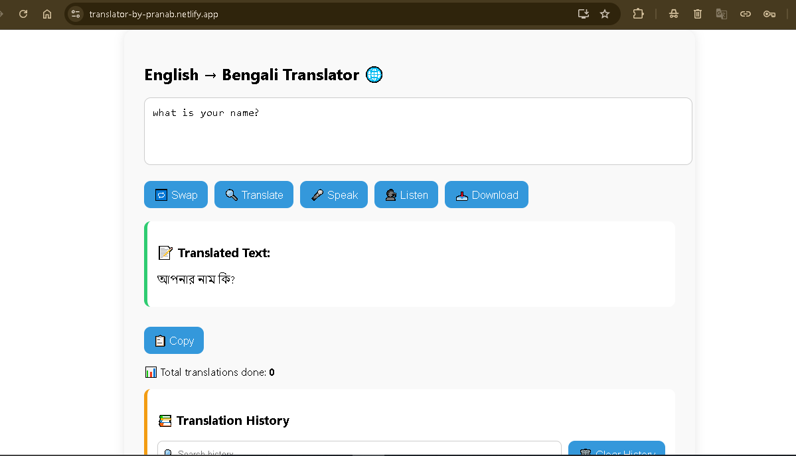
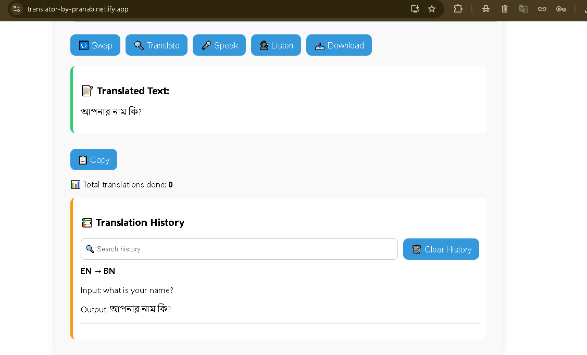

# 🌐 Translator App

This is a simple web application that translates text between languages using **Deep Translator** (previously Googletrans), built with:

- 🔥 Flask (Python) for the backend
- ⚛️ React for the frontend
- 🌍 Supports language selection (source → target)
- 📁 Maintains translation history and allows download/clear
- 📦 Deployed using Render (backend) + Netlify (frontend)

## 🔗 Click the link for Demo

➡️ <a href="https://translator-by-pranab.netlify.app" target="_blank">View Live</a>

---

## 📸 Screenshots
### 🔤 Home Page UI

---

## 🚀 Features

- Text translation using `deep-translator`
- Stores translation history
- Stats endpoint to track total translations
- Download and clear history functionality
- Fully mobile responsive React frontend
- CORS enabled for frontend-backend communication
  
---

## 🛠 Technologies

| Frontend | Backend  | Translation |
|----------|----------|-------------|
| React    | Flask    | Deep Translator (`deep-translator`) |
| Axios    | Flask-CORS |             |

---

## 📁  Project Structure

    Translator/
    ├── backend/
    │ ├── app.py
    │ ├── requirements.txt
    │ └── translation_history.txt
    ├── frontend/
    │ └── (React files: App.js, App.css, etc.)
    ├── README.md

---

## 🛠️ How to Run

### ⚙️ Backend Setup (Flask)

1. Install dependencies:

       pip install -r requirements.txt
---

2. Run server:
   
       python app.py
   
Or use Gunicorn (for production):

    gunicorn app:app

### 🌐 Frontend Setup (React)
Inside the frontend folder:

    npm install
    npm start
Set .env file:

    REACT_APP_API_URL=https://your-backend-url.onrender.com

---

### 📤 Deployment

-Backend (Flask): Hosted on Render

-Frontend (React): Hosted on Netlify

---

### 📈 Endpoints

| Route            | Method | Description                |
| ---------------- | ------ | -------------------------- |
| `/translate`     | POST   | Translate given text       |
| `/stats`         | GET    | Returns total translations |
| `/download`      | GET    | Downloads history file     |
| `/clear-history` | POST   | Clears the history file    |

---

### 🙏 Special Thanks
Thanks to all open-source libraries and the developer community 💛

---

### 📜 License

    This project is open source and available under the MIT License.

---

### 👨‍💻 Author

- Made with ❤️ by Pranab Mahata
- [GitHub](https://github.com/rnccsstudent)

---

### 💬 Feedback

      If you find a bug or want to suggest a feature, feel free to open an issue or a pull request.

---
